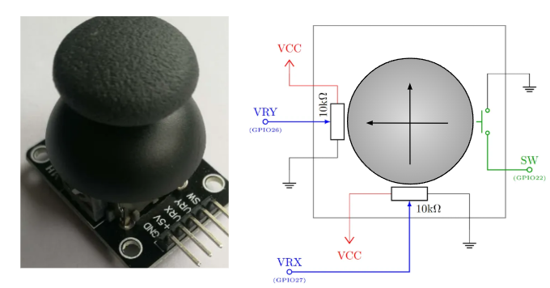
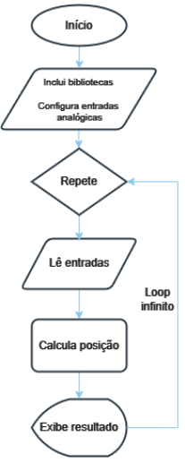

# Joystick
A seguir desenvolvemos, passo-a-passo,  as etapas de síntese de um programa - em linguagem C - para ler a posição do joystick, presente na BitDogLab, e exibir o resultado no terminal do VS Code. 
## Atividade: 
Vamos desenvolver um programa - em C - para ler a posição do Joystick analógico da BitDogLab, calcular a posição em uma barra de progresso e exibir o resultado no terminal. O programa deve ser estruturado para realizar estas tarefas de forma repetitiva, lendo e exibindo as informações continuamente.
## Desenvolvimento: 
Como ponto de partida podemos identificar os elementos, ou interfaces, de entrada e saída que serão usados no nosso hardware para implementar este projeto. 
A interface de entrada é um joystick que converte a posição da sua alavanca em sinais eletrônicos. No caso da BitDogLab temos um joystick analógico em que a posição x e y da alavanca é convertida em dois níveis de tensão (sinais) que variam de 0 até 3,3V. A figura a seguir mostra a fotografia de um joystick ao lado do seu esquema elétrico simplificado. 

  
Figura: foto do joystick e seu esquema elétrico simplificado

Quando o joystick está na posição neutra os valores dos sinais são Vx = Vy = VCC/2. O movimento da alavanca do joystick altera proporcionalmente o valor destes sinais. Os conversores Analógico Digitais, acessiveis através dos GPIOs 26 e 27 do microcotrolador RP2040, convertem estes sinais analógicos em palavras digitais que a partir daí estão prontos para a próxima etapa de processamento. Além disto, este joystick também possui um botão que pode ser acionado quando o usuário aperta a alavanca. Este botão está conectado ao GPIO 22, que deve ser configurado com entrada digital com pull-up no RP2040. 
Vamos usar como interface de saída o próprio terminal do VS Code.  Desta forma, podemos exibir tanto o valor dos sinais analógicos como uma barra que se movimenta proporcionalmente a posição do joystick. 
Tendo definidas as entradas e saídas, podemos trabalhar na síntese do código. Um bom ponto de partida é começar a fazer um mapa mental usando o desenho de um fluxograma.  

  
Figura: fluxograma do código para processar as entradas vindas do joystick. OBS: Editado no Drawio

A partir deste fluxograma, vamos destacar e detalhar as seguintes etapas principais num novo documento chamado de pseudocódigo.  
   
   
- Início: Representa o ponto de partida do programa.  
  
- Configuração de Inicialização: O programa começa incluindo bibliotecas e configurando as entradas analógicas que serão usadas para ler o joystick.  
  
- Loop Infinito: Uma estrutura de repetição (loop) onde o programa lê continuamente os valores do joystick e exibe os resultados. Esse loop continuará a execução indefinidamente.  
  
- Leitura das Entradas: No loop, o programa lê os valores das entradas analógicas do joystick, tanto para o eixo X quanto para o eixo Y.  
  
- Cálculo da Posição: Com os valores lidos, o programa calcula a posição do joystick em uma barra de 40 caracteres de largura.  
  
- Exibição dos Resultados: O programa exibe no terminal uma barra de progresso que representa graficamente a posição do joystick.  
  
- Retorno ao Início do Loop: Após exibir o resultado, o programa espera brevemente e retorna ao início do loop para repetir o processo.  
  
  
Na etapa seguinte podemos transcrever o pseudocódigo em um programa escolhendo alguma linguagem específica, respeitando sua sintaxe e convenções. Esta construção pode ser realizada etapa por etapa respeitando a sequência do pseudocódigo ou então pode ser reaproveitada de um repositório. Normalmente é aqui que o desenvolvedor investe um certo tempo depurando o código e testando até que o resultado atenda as suas espectativas.    
  
No caso desta atividade vamos usar C. Segue o código em linguagem C para a leitura e exibição da posição de um joystick:  
[Fonte de referência](https://github.com/raspberrypi/pico-examples/blob/master/adc/joystick_display/joystick_display.c) 


## Pseudocódigo e Código - Linguagem C
  
Início: Representa o ponto de partida do programa. Para começar, incluímos um comentário e a referência:
```c
/**
 * Embarcatech adaptado de: 
 * Copyright (c) 2020 Raspberry Pi (Trading) Ltd.
 * SPDX-License-Identifier: BSD-3-Clause
 */
```

Configuração de Inicialização: O programa começa incluindo bibliotecas e configurando as entradas analógicas que serão usadas para ler o joystick.

```c
#include <stdio.h>
#include "pico/stdlib.h"
#include "hardware/adc.h"

int main() {
    // Inicializa as interfaces de entrada e      saída padrão (UART)
    stdio_init_all();
    // Inicializa o conversor analógico-digital (ADC)
     adc_init();

// Configura os pinos GPIO 26 e 27 como entradas de ADC (alta impedância, sem resistores pull-up)
    adc_gpio_init(26);
    adc_gpio_init(27);
```
- Loop Infinito: Uma estrutura de repetição (loop) onde o programa lê continuamente os valores do joystick e exibe os resultados. Esse loop continuará a execução indefinidamente.  
- Leitura das Entradas: No loop, o programa lê os valores das entradas analógicas do joystick, tanto para o eixo X quanto para o eixo Y.  
- Cálculo da Posição: Com os valores lidos, o programa calcula a posição do joystick em uma barra de 40 caracteres de largura.  
- Exibição dos Resultados: O programa exibe no terminal uma barra de progresso que representa graficamente a posição do joystick.  
- Retorno ao Início do Loop: Após exibir o resultado, o programa espera brevemente e retorna ao início do loop para repetir o processo.

```c
// Inicia o loop infinito para leitura e exibição dos valores do joystick
    while (1) {
        // Seleciona a entrada ADC 0 (conectada ao eixo X do joystick)
        adc_select_input(1);
        // Lê o valor do ADC para o eixo X
        uint adc_x_raw = adc_read();
        
        // Seleciona a entrada ADC 1 (conectada ao eixo Y do joystick)
        adc_select_input(0);
        // Lê o valor do ADC para o eixo Y
        uint adc_y_raw = adc_read();

        // Configuração da barra de exibição dos valores de X e Y no terminal
    // Mostra a posição do joystick de uma forma como esta: 
        // X: [            o             ]  Y: [              o         ]
        const uint bar_width = 40; // Define a largura da barra
        const uint adc_max = (1 << 12) - 1; // Valor máximo do ADC (12 bits, então 4095)
        
        // Calcula a posição do marcador 'o' na barra de X e Y com base nos valores lidos
        uint bar_x_pos = adc_x_raw * bar_width / adc_max;
        uint bar_y_pos = adc_y_raw * bar_width / adc_max;
        
        // Exibe a barra do eixo X no terminal
        printf("\rX: [");
        for (uint i = 0; i < bar_width; ++i)
            putchar(i == bar_x_pos ? 'o' : ' ');
        printf("]  Y: [");
        
        // Exibe a barra do eixo Y no terminal
        for (uint i = 0; i < bar_width; ++i)
            putchar(i == bar_y_pos ? 'o' : ' ');
        printf("]");
        
        // Pausa o programa por 50 milissegundos antes de ler novamente
        sleep_ms(50);
    }
}
```


## Código completo em C   

```c
/**
 * Embarcatech adaptado de: 
 * Copyright (c) 2020 Raspberry Pi (Trading) Ltd.
 * SPDX-License-Identifier: BSD-3-Clause
 */

#include <stdio.h>
#include "pico/stdlib.h"
#include "hardware/adc.h"

int main() {
    // Inicializa as interfaces de entrada e saída padrão (UART)
    stdio_init_all();
    // Inicializa o conversor analógico-digital (ADC)
    adc_init();
    
    // Configura os pinos GPIO 26 e 27 como entradas de ADC (alta impedância, sem resistores pull-up)
    adc_gpio_init(26);
    adc_gpio_init(27);

    // Inicia o loop infinito para leitura e exibição dos valores do joystick
    while (1) {
        // Seleciona a entrada ADC 0 (conectada ao eixo X do joystick)
        adc_select_input(1);
        // Lê o valor do ADC para o eixo X
        uint adc_x_raw = adc_read();
        
        // Seleciona a entrada ADC 1 (conectada ao eixo Y do joystick)
        adc_select_input(0);
        // Lê o valor do ADC para o eixo Y
        uint adc_y_raw = adc_read();

        // Configuração da barra de exibição dos valores de X e Y no terminal
    // Mostra a posição do joystick de uma forma como esta: 
        // X: [            o             ]  Y: [              o         ]
        const uint bar_width = 40; // Define a largura da barra
        const uint adc_max = (1 << 12) - 1; // Valor máximo do ADC (12 bits, então 4095)
        
        // Calcula a posição do marcador 'o' na barra de X e Y com base nos valores lidos
        uint bar_x_pos = adc_x_raw * bar_width / adc_max;
        uint bar_y_pos = adc_y_raw * bar_width / adc_max;
        
        // Exibe a barra do eixo X no terminal
        printf("\rX: [");
        for (uint i = 0; i < bar_width; ++i)
            putchar(i == bar_x_pos ? 'o' : ' ');
        printf("]  Y: [");
        
        // Exibe a barra do eixo Y no terminal
        for (uint i = 0; i < bar_width; ++i)
            putchar(i == bar_y_pos ? 'o' : ' ');
        printf("]");
        
        // Pausa o programa por 50 milissegundos antes de ler novamente
        sleep_ms(50);
    }
}
```


## Arquivo CMake
Além do arquivo em C (extensão .c), é necessário configurar um arquivo CMake para compilar e executar o programa na Raspberry Pi Pico. Esse arquivo, geralmente chamado CMakeLists.txt, define as configurações de build do projeto, como as bibliotecas que serão usadas, os arquivos de origem e as especificações do sistema.
Aqui está um exemplo básico do CMakeLists.txt para este projeto:

## CMakeLists.txt
```ruby
# Define o executável do projeto, especificando o arquivo principal (joystick_display.c)
add_executable(joystick_display
        joystick_display.c
        )

# Vincula as bibliotecas necessárias para o funcionamento do programa
# pico_stdlib: Inclui as bibliotecas padrão da Raspberry Pi Pico
# hardware_adc: Habilita o uso do ADC (Conversor Analógico-Digital)
target_link_libraries(joystick_display pico_stdlib hardware_adc)

# Gera arquivos adicionais como .map, .bin, .hex, etc., necessários para a programação do microcontrolador
pico_add_extra_outputs(joystick_display)

# Define a URL de referência para este exemplo (opcional)
# Isso é útil se você estiver compartilhando o código e quiser apontar para uma fonte online
example_auto_set_url(joystick_display)

```
Explicação dos principais comandos do CMAKE:  
- add_executable: Define o executável para o projeto, especificando o arquivo fonte principal joystick_display.c.
- target_link_libraries: Adiciona as bibliotecas necessárias. pico_stdlib é a biblioteca padrão da Raspberry Pi Pico, e hardware_adc permite o uso do ADC.
- pico_add_extra_outputs: Gera arquivos adicionais, como .uf2, .bin, e .hex, para facilitar o carregamento do código na Pico.
- example_auto_set_url: Define uma URL associada a este exemplo (geralmente um link para a documentação ou o repositório). Esse passo é opcional, mas útil para referência.  
## Exercícios: 

Faça uma adaptação neste código em C de forma que o programa saia do loop infinito e exiba uma mensagem de finalização no terminal quando o botão do joystick for apertado. Comece pelo fluxograma, depois modifique o pseudocódigo e por fim implemente e depure seu código em C. Faça um vídeo mostrando seu funcionamento e carregue no Moodle.   
  

Faça uma adaptação neste código em C de forma que o joystick comande um efeito de deslocamento nos LEDs da matriz RGB da BitDogLab. Faça um vídeo, de no máximo 15 segundos, mostrando seu funcionamento e carregue no Moodle. 
